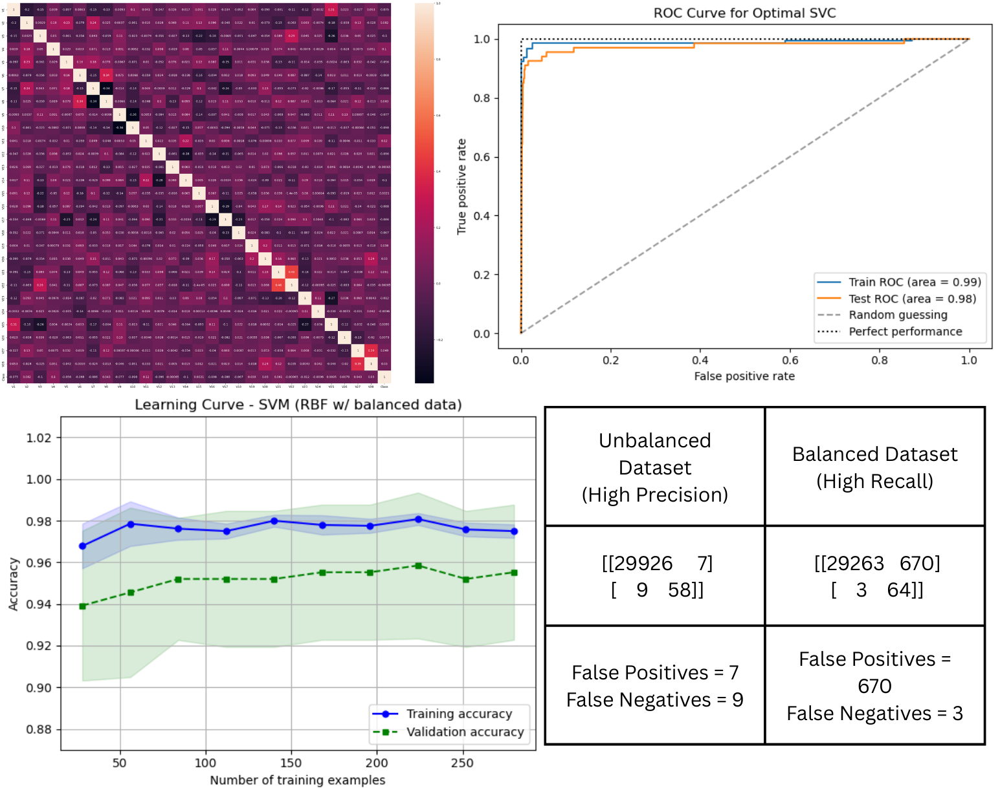

# Identifying Fraudulent Credit Card Transactions using Machine Learning

## Overview

This project addresses the critical challenge of credit card fraud detection by applying machine learning to an imbalanced dataset. The analysis follows a structured process from initial data exploration to model evaluation, providing insights into which algorithms perform best for this specific problem.

*A composite of key insights: Features heatmap (top-left), model comparison via ROC curves (top-right), SVM learning curves (bottom-left), and final performance from confusion matrices of the SVM models(bottom-right).*

**Full Code & Analysis:** 

[View Jupyter Notebook on GitHub](analysis/fraud_detection_analysis.ipynb)  

---

## Objective

A comparative machine learning project aimed at minimizing financial fraud by developing and evaluating predictive models on a highly imbalanced dataset of credit card transactions.

**Goal:** To identify the most effective machine learning model for accurately detecting fraudulent transactions while minimizing false positives.

## Process & Methodology
1. **Data Loading & Inspection:** Used Python and Pandas to load the raw CSV data and perform preliminary checks on its structure, size, and class distribution.
2. **Data Cleaning & Preprocessing:** Handled outliers using the IQR method and applied feature scaling using StandardScaler and Normalizer to prepare data for modeling.
3. **Exploratory Data Analysis (EDA):** Analyzed feature distributions through histograms and examined correlations using a heatmap to identify key relationships.
4. **Algorithm Selection & Training:** Built and compared three machine learning models—Decision Tree, k-Nearest Neighbors (kNN), and Support Vector Machine (SVM)—on both unbalanced and balanced datasets.
5. **Model Evaluation:** Estimated performance using accuracy, precision, recall, F1-score, and ROC-AUC metrics. Implemented 10-Fold Cross-Validation for robust results.
6. **Advanced Analysis:** Generated learning curves, performed hyperparameter tuning via Grid Search, and created ROC curves to visualize model performance trade-offs.

## Key Findings

- **Best Overall Model:** SVM with RBF kernel on unbalanced data achieved **99.95% accuracy** and **0.999 ROC-AUC score**
- **kNN Performance:** Showed strong results with **99.94% accuracy** on unbalanced data
- **Balanced Dataset Impact:** Improved fraud recall but significantly reduced precision across all models
- **Feature Correlation:** V11, V4, V2 showed highest correlation with genuine transactions; V14, V10, V12 with fraudulent transactions

## Results Summary

| Model | Dataset | Accuracy | Precision (Fraud) | Recall (Fraud) | F1-Score (Fraud) | ROC-AUC |
| :--- | :--- | :--- | :--- | :--- | :--- | :--- |
| **Decision Tree** | Imbalanced | 99.92% | 0.83 | 0.79 | 0.81 | 0.956 |
| **kNN** | Imbalanced | 99.94% | 0.89 | 0.87 | 0.88 | 0.992 |
| **SVM (RBF)** | Imbalanced | **99.95%** | **0.89** | **0.87** | **0.88** | **0.999** |
| **Decision Tree** | Balanced | 79.42% | 0.01 | 0.97 | 0.02 | 0.883 |
| **kNN** | Balanced | 98.01% | 0.10 | 0.93 | 0.17 | 0.973 |
| **SVM (Linear)** | Balanced | 97.76% | 0.09 | 0.96 | 0.16 | 0.999 |

## Conclusions & Recommendations

### **Observations from Classification Reports**
- **Unbalanced Dataset:** Models achieved high accuracy but struggled with fraud class precision
- **Balanced Dataset:** Improved fraud recall but drastically reduced precision
- **SVM Performance:** Consistently delivered the best results across both datasets

### Learning Curve Analysis
- **Decision Tree:** Showed signs of overfitting (high variance)
- **kNN:** Demonstrated good generalization capabilities
- **SVM:** Exhibited stable performance with low bias and variance

### Recommendation
My overall conclusions are that the SVM model seem to work well across both datasets and has high accuracy and can be effective when finding fraud with less false positives. The kNN model seems to do well on the balanced dataset compared to the unbalanced dataset and the decision tree seems to have the highest amount of false positives. I would recommend using the SVM model in order to minimize fraud because it shows to be effective in identifying fraud transactions without having false positives.

---

## Tools Used

- **Python** (Pandas, NumPy, Matplotlib, Seaborn)
- **Scikit-learn** (DecisionTreeClassifier, KNeighborsClassifier, SVC)
- **Data Preprocessing** (StandardScaler, Normalizer)
- **Model Evaluation** (accuracy_score, precision_score, recall_score, f1_score, roc_auc_score)
- **Validation** (KFold Cross-Validation, GridSearchCV)
- **Visualization** (Learning Curves, ROC Curves, Confusion Matrices)

## Data Source
- [**Kaggle** Credit Card Fraud Detection Dataset](https://www.kaggle.com/datasets/mlg-ulb/creditcardfraud)
